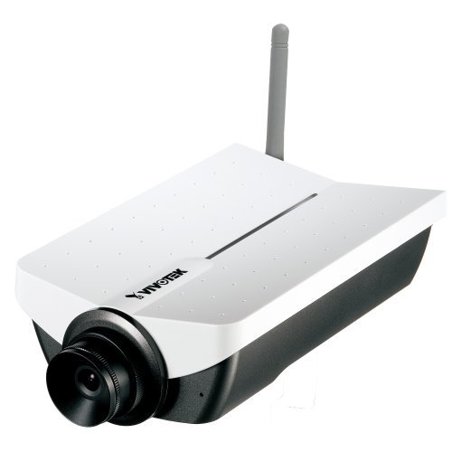

# cameraip
All about camera IP

## VIVOTEK IP7132- CAMARA PARA INTERNET INALAMBRICA / AUDIO/ MPEG4/ 3GPP

### La nueva cÁmara IP7132 con nueva tecnología chipset vivotek le ofrece una mejor calidad en imagén en formato MPEG-4 a 30 Imagenes Por Segundo en una resolución VGA, dando a los usuarios una imagen limpia y clara, tambien incluye la tecnología de monitoreo movil 3GPP con el cual usted podra visualizar su camara desde celulares con estÁ tecnología. En México el carrier en celulares que cuenta con esta tecnología es Iusacell. Sin lugar a duda, la mejor cÁmara en el mercado con tecnología 3GPP.

## Principales Características:
* Compresión MPEG-4 en tiempo Real en tamaño VGA
* CÁmara inalÁmbrica WiFi con estandar IEEE 802.11 b/g.
* Soporta Video vigilancia Movil (3GPP)
* Óptima sincronización de audio y video
* Detector de movimiento inteligente
* Envío de imÁgenes antes y después de alarma
* Entrada y salida digital I/O para censor y alarma
* Software gratuito para la grabación de hasta 32 cÁmaras.
